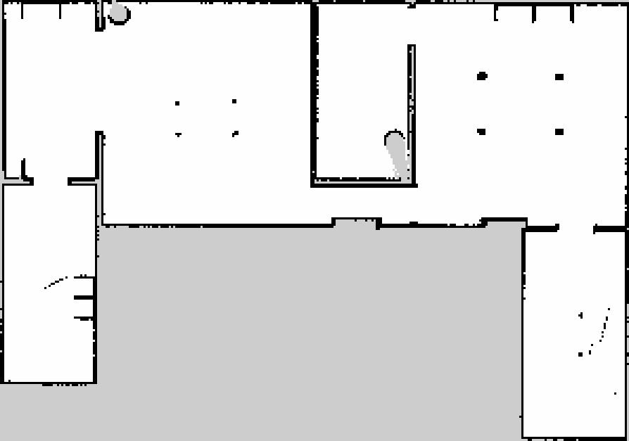
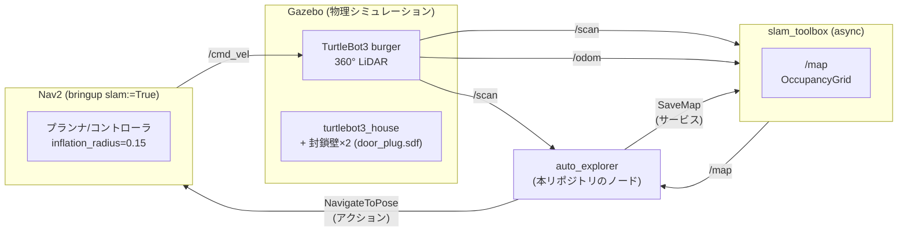
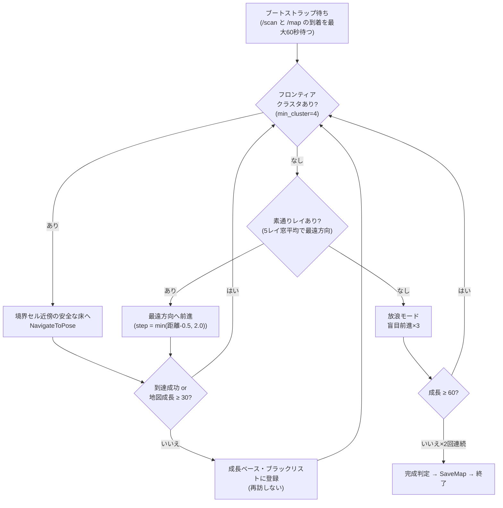
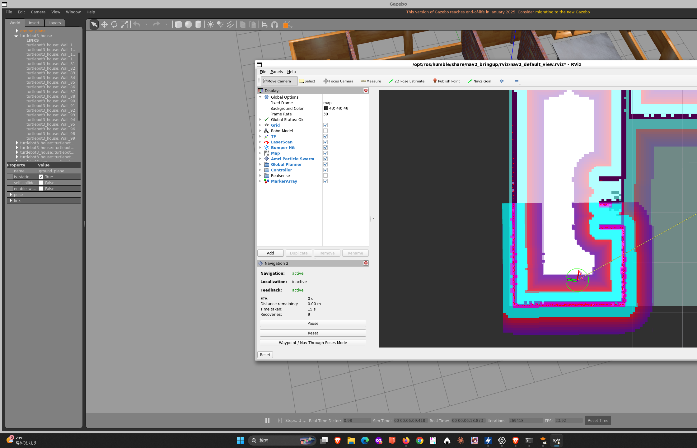

# ros2-auto-mapper — 指示なしで家の地図を描く自律地図化ロボット

ROS 2 Humble + Gazebo + slam_toolbox + Nav2 で、**人間の指示ゼロで室内を自走して完全な地図を作る**プロジェクトです。
TurtleBot3(burger)が玄関を封鎖した家(turtlebot3_house)の中を自分で歩き回り、
「もう描く場所がない」ことを自己判定して地図を保存します。



> 最終成果: **39,819セル** — 家の全屋内(北の部屋群・東廊下・北東の部屋群・南東の部屋・西翼)を完全地図化。
> 中央のグレー領域は中庭(=屋外)で、玄関封鎖により**意図的に**未知のまま。

## 何ができるか

- `scripts/run_sealed_mapping.sh` の1コマンドで「環境リセット → シミュレーション起動 → 玄関封鎖 → SLAM/Nav2起動 → 健全性検証 → 完全自動探索 → 地図保存」まで全部やる
- 探索は3段構え: **フロンティア探索**(未知との境界へ) → **LiDARレイ・フォールバック**(反射のない方向へ前進) → **放浪モード**(盲目前進で最終確認)
- 完成判定は三重チェック: 「フロンティアなし AND 素通りレイなし AND 放浪しても地図が成長しない」

## システム構成



## 探索アルゴリズム



詳細は [docs/algorithm.md](docs/algorithm.md)、ソースの読み解きは [docs/code_reading.md](docs/code_reading.md) を参照。

## クイックスタート

```bash
# 前提: ROS 2 Humble / turtlebot3_gazebo / slam_toolbox / nav2_bringup 導入済み
cd ~/ros2_ws/src
git clone https://github.com/masumi82/ros2-auto-mapper.git
cp -r ros2-auto-mapper/auto_mapper .          # ROS 2パッケージをワークスペースへ
cd ~/ros2_ws && colcon build --packages-select auto_mapper
source install/setup.bash

# 一発実行(リセット→起動→検証→完全自動探索→保存)
bash src/ros2-auto-mapper/scripts/run_sealed_mapping.sh
```

観戦したい場合は別ターミナルで:

```bash
rviz2 -d /opt/ros/humble/share/nav2_bringup/rviz/nav2_default_view.rviz \
  --ros-args -p use_sim_time:=true
```

探索が細い廊下の手前で止まったら(既知の制約):

```bash
pkill -9 -f "auto_explore[r]"
python3 src/ros2-auto-mapper/scripts/corridor_march.py   # 廊下を直接ゴール指定で突破
ros2 run auto_mapper auto_explorer --ros-args -p use_sim_time:=true  # 探索再開
```

## リポジトリ構成

| パス | 内容 |
|---|---|
| `auto_mapper/` | ROS 2パッケージ(自律探索ノード `auto_explorer`) |
| `scripts/run_sealed_mapping.sh` | 統合実行スクリプト(リセット→起動→検証→探索) |
| `scripts/corridor_march.py` | 細い廊下をNav2直接ゴールで突破する補助スクリプト |
| `config/nav2_params_explore.yaml` | 探索用Nav2設定(track_unknown_space=false, inflation=0.15) |
| `worlds/door_plug.sdf` | 玄関封鎖壁モデル(1.1×0.3×1.0m) |
| `maps/` | 最終成果の地図(house_sealed_final.pgm/yaml) |
|  `docs/` | 設計・アルゴリズム・教訓・エビデンス画像 |

## 成果とエビデンス

| 記録 | セル数 | 内容 |
|---|---|---|
| 半自動探索(経由地指定) | 15,118 | 人間が経由地を与えた場合 |
| 完全自動・初期版 | 15,916 | フロンティア+レイ・フォールバック |
| 自作密閉ハウス | 17,904 | 4部屋密閉ワールドで100%達成 |
| 密閉TB3ハウス(西半分) | 19,993 | inflation=0.55で東廊下が通れず「完成」誤判定 |
| **密閉TB3ハウス(全域)** | **39,819** | **inflation=0.15+廊下突破で家全体を制覇** |

- 稼働中のRViz+Nav2画面: 
- 途中経過(西半分のみの時点): [result_sealed_final_map.png](docs/images/result_sealed_final_map.png)
- 完了時のRViz画面: [result_full_house_screen.png](docs/images/result_full_house_screen.png)

## ハマりどころ(抜粋)

実際に踏んだ罠と対策の完全版は [docs/lessons.md](docs/lessons.md) にあります。代表例:

1. **turtlebot3_houseのデフォルトスポーンは屋外**(中庭)。`x_pose:=-3.0 y_pose:=2.0` で屋内に
2. **inflation_radius 0.55mは幅0.8mの廊下を数学的に封鎖する**(0.55×2 > 0.8)
3. **壁やドアの位置はSDFの机上計算ではなくSLAM実測地図から求める**(2回失敗して学んだ)
4. `pkill -f` は自分自身のコマンド文字列にもマッチする — スクリプトファイル化が根本対策
5. `"sync_slam"` は `"async_slam"` の部分文字列 — pkillはパス付き `"/sync_slam"` で

## ライセンス

MIT
