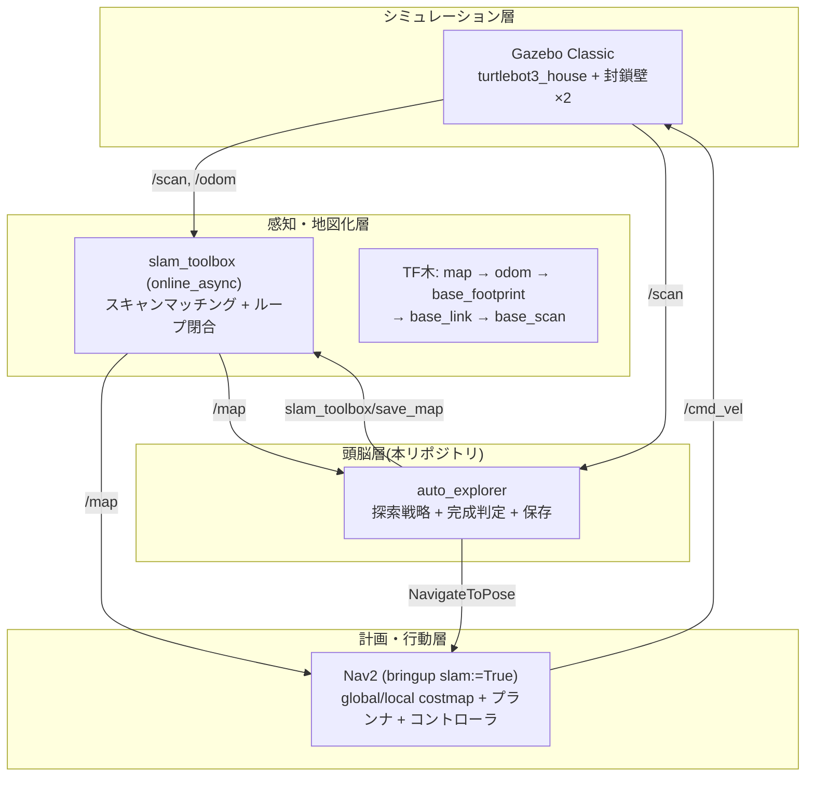
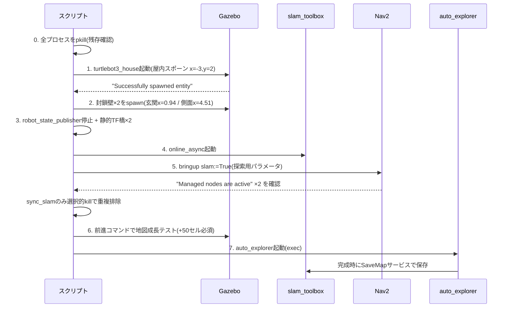

# システム構成

## 全体像

「感知 → 地図化 → 計画 → 行動 → 記録」のロボット基本ループを、既製のROS 2スタックと
自作ノード1つ(`auto_explorer`)の組み合わせで実現しています。

## 起動シーケンス(run_sealed_mapping.sh)

## 設計上のポイント

### なぜ bringup slam:=True か
保存地図+AMCL方式は「地図原点(SLAM起動時のロボット位置)とodom原点のずれ」の
初期位置合わせが必要になる。SLAM同時実行なら位置合わせ不要で、探索中の地図が
そのままNav2のコストマップに流れる。

### なぜ静的TF橋か
robot_state_publisherがフレーム名にスラッシュ付きの旧形式TFを流す個体があり、
TF木が壊れる。rspを止めて `base_footprint→base_link` (z=0.010) と
`base_link→base_scan` (x=-0.032, z=0.172) をstatic_transform_publisherで直接張る。

### なぜスクリプトファイル化か
`pkill -f <pattern>` はssh/bash -cで渡した自分自身のコマンド文字列にもマッチして
自爆する。`"[a]uto_explorer"` のブラケット回避も、同一コマンド内に実文字列が
含まれるケース(setsid内のlaunch名など)には無力。スクリプトをファイルとして
実行すればコマンドラインにパターンが現れず、根絶できる。

### 封鎖壁の座標はどう決めたか
SDFの壁定義から机上計算した座標は2回連続で間違えた(コの字型の中庭を屋内と誤認、
玄関位置も誤認)。最終的には**SLAMが実際に描いた地図の南壁ラインを走査して
開口部を実測**し、玄関=x[0.66,1.21]、側面隙間=x[4.36,4.66]と確定した。
